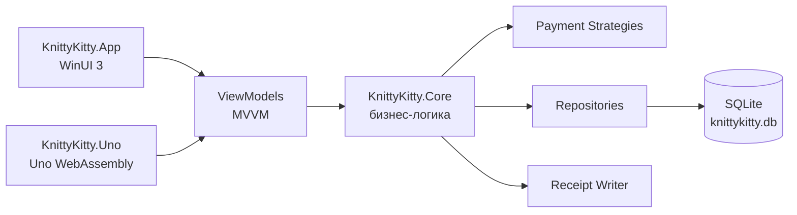

# Knitty Kitty

Курсовая работа по дисциплине **«Технологии программирования»**: приложение магазина вязанных товаров с каталогом, корзиной, бонусной картой, смешанной оплатой, историей покупок и сохранением чеков.

Проект реализован в двух интерфейсах:

- **KnittyKitty.App** — настольное приложение на WinUI 3.
- **KnittyKitty.Uno** — версия на Uno Platform, включая WebAssembly.

## Краткое описание

Knitty Kitty имитирует работу магазина вязанных товаров. Пользователь может войти в аккаунт, просматривать каталог, выбирать товары, указывать цвет там, где это предусмотрено, взвешивать весовые позиции, добавлять товары в корзину и оплачивать покупку наличными, картой, бонусами или несколькими способами сразу.

После успешной покупки приложение обновляет остатки и балансы, начисляет кэшбек, сохраняет покупку в истории текущей сессии и формирует текстовый чек.

## Возможности

- Авторизация и регистрация покупателей.
- Каталог товаров из SQLite-хранилища.
- Категории товаров: одежда, игрушки, сумки, аксессуары, материалы, упаковка.
- Выбор цвета только у товаров, для которых он действительно предусмотрен.
- Весовые товары с обязательным взвешиванием перед добавлением в корзину.
- Корзина с изменением количества и удалением позиций.
- Проверка остатков на складе.
- Оплата наличными, картой и бонусами.
- Смешанная оплата одной покупки несколькими способами.
- Проверка нехватки средств до завершения покупки.
- Начисление кэшбека бонусами.
- История покупок за текущую сессию.
- Автоматическое сохранение чека после покупки.
- Административный режим для управления товарами и остатками.
- Минимальный размер окна 1280x1200 для WinUI и Uno WebAssembly.

## Соответствие заданию

| Требование курсовой работы | Реализация в проекте |
| --- | --- |
| Имитация покупки товаров в магазине | Каталог, корзина, оформление покупки и чек |
| У покупателя есть бонусная карта, наличные и карта | Балансы пользователя хранятся в SQLite и обновляются после покупки |
| Добавление и удаление товаров из списка покупок | Корзина поддерживает изменение состава заказа |
| Взвешивание части товаров | Весовые товары нельзя добавить без указанного веса |
| Оплата наличными, картой и бонусами | Реализованы отдельные стратегии оплаты |
| Частичная и смешанная оплата | Покупку можно оплатить несколькими способами |
| Ошибка при нехватке средств | Покупка не завершается, если средств недостаточно |
| Ошибка для невзвешенного товара | Пользователь получает предупреждение до добавления в корзину |
| Сохранение чека после покупки | Чек сохраняется в текстовый файл |
| Товары загружаются из внешнего хранилища | Используется SQLite-база данных |
| Unit-тесты | Проект `KnittyKitty.Tests` проверяет ключевую бизнес-логику |
| Принципы ООП и SOLID | Бизнес-логика вынесена в `Core`, зависимости разделены интерфейсами |
| Архитектурный паттерн | Используется MVVM |
| Не менее двух паттернов проектирования | Repository, Strategy, Factory, Command |

## Технологии

- C# и .NET 10.
- WinUI 3 для настольной версии.
- Uno Platform для WebAssembly-версии.
- SQLite для хранения пользователей, товаров, цветов и остатков.
- MVVM для разделения интерфейса и логики.
- Microsoft Testing Platform для unit-тестов.

## Архитектура



Основная логика находится в `KnittyKitty.Core`, поэтому WinUI- и Uno-интерфейсы используют один и тот же доменный слой. Это уменьшает дублирование и делает поведение обеих сборок одинаковым.

## Структура проекта

```text
.
├── src
│   ├── KnittyKitty.Core        # модели, сервисы, репозитории, оплата, чеки
│   ├── KnittyKitty.App         # WinUI 3 приложение
│   └── KnittyKitty.Uno         # Uno Platform / WebAssembly приложение
├── tests
│   └── KnittyKitty.Tests       # unit-тесты бизнес-логики
├── KnittyKitty.sln
└── README.md
```

## Используемые паттерны

| Паттерн | Где используется | Зачем нужен |
| --- | --- | --- |
| MVVM | View, ViewModel, сервисы | Разделяет интерфейс и бизнес-логику |
| Repository | Репозитории SQLite | Скрывает детали работы с базой данных |
| Strategy | Способы оплаты | Позволяет независимо реализовать оплату наличными, картой и бонусами |
| Factory | Создание товаров | Централизует создание доменных объектов |
| Command | Команды ViewModel | Связывает действия пользователя с логикой приложения |

## Данные приложения

В базе уже подготовлен демонстрационный каталог:

- всего товаров: **17**;
- категории: одежда, игрушки, сумки, аксессуары, материалы, упаковка;
- весовые товары находятся в категории материалов;
- товары с выбором цвета имеют ограниченный список допустимых цветов;
- товары без выбора цвета не показывают лишние варианты.

Демонстрационный аккаунт покупателя:

| Пользователь | Email | Пароль |
| --- | --- | --- |
| Маша | `masha@yandex.ru` | `masha_123` |

Также можно создать нового пользователя через форму регистрации.

## Как запустить

Перед запуском нужен установленный .NET SDK 10 и workloads для WinUI/Uno Platform.

Восстановить зависимости:

```powershell
dotnet restore KnittyKitty.sln
```

Запустить тесты:

```powershell
dotnet test tests\KnittyKitty.Tests\KnittyKitty.Tests.csproj
```

Собрать WinUI-приложение:

```powershell
dotnet build src\KnittyKitty.App\KnittyKitty.App.csproj -p:Platform=x64
```

Запустить WinUI-приложение:

```powershell
dotnet run --project src\KnittyKitty.App\KnittyKitty.App.csproj -p:Platform=x64
```

Собрать WebAssembly-версию:

```powershell
dotnet build src\KnittyKitty.Uno\KnittyKitty.Uno\KnittyKitty.Uno.csproj -f net10.0-browserwasm
```

Запустить WebAssembly-версию:

```powershell
dotnet run --project src\KnittyKitty.Uno\KnittyKitty.Uno\KnittyKitty.Uno.csproj -f net10.0-browserwasm
```

По умолчанию Uno WebAssembly открывается на локальном адресе:

```text
http://localhost:5000
```

## Сценарий для демонстрации на защите

1. Войти под аккаунтом `masha@yandex.ru` / `masha_123`.
2. Открыть каталог и показать товары разных категорий.
3. Выбрать товар с цветом и убедиться, что доступны только подходящие цвета.
4. Попробовать добавить весовой товар без веса — приложение не позволит это сделать.
5. Указать вес и добавить товар в корзину.
6. Добавить несколько обычных товаров.
7. Изменить количество или удалить позицию из корзины.
8. Оформить покупку смешанной оплатой: часть наличными, часть картой, часть бонусами.
9. Показать изменение балансов и начисление кэшбека.
10. Открыть историю покупок текущей сессии.
11. Найти сформированный чек с названием магазина **«Магазин вязанных товаров»**.

## Тестирование

Unit-тесты проверяют ключевые сценарии:

- добавление товаров в корзину;
- работу с весовыми товарами;
- разделение товаров по цветам;
- смешанную оплату;
- откат покупки при нехватке средств;
- сохранение чеков;
- корректность начальных данных SQLite.

Команда для проверки:

```powershell
dotnet test tests\KnittyKitty.Tests\KnittyKitty.Tests.csproj
```

Актуальная проверка проекта: **11 тестов успешно пройдены**.

## Чеки

После каждой успешной покупки создается текстовый чек. В нем сохраняются:

- название магазина;
- дата и время покупки;
- список товаров;
- количество, вес и стоимость позиций;
- способы оплаты;
- итоговая сумма;
- начисленный кэшбек.

Название магазина в чеке: **«Магазин вязанных товаров»**.

## Примечания

- В WinUI-версии окно нельзя уменьшить меньше 1280x1200.
- В WebAssembly-версии рабочая область приложения имеет минимальный размер 1280x1200; если окно браузера меньше, страница остается прокручиваемой.
- Данные каталога и пользователей инициализируются автоматически при первом запуске.
- README написан для размещения в GitHub-репозитории и быстрой демонстрации проекта преподавателю.
